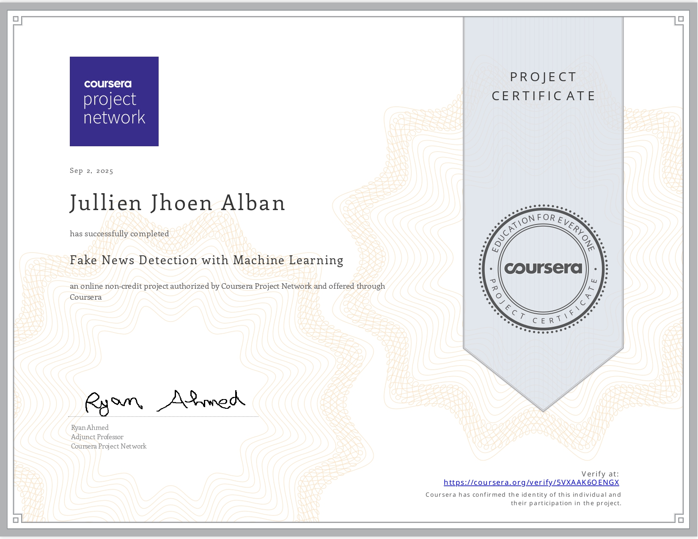

# NLP-Fake-News-Detector
A project for Fake News Detection using Machine Learning with the following objectives:

1. Apply python libraries to import and visualize datasets
2. Perform exploratory data analysis and plot word-cloud
3. Perform text data cleaning such as removing punctuation and stop words
4. Understand the concept of tokenizer.
5. Perform tokenizing and padding on text corpus to feed the deep learning model.
6. Understand the theory and intuition behind Recurrent Neural Networks and LSTM
7. Build and train the deep learning model
8. Access the performance of the trained model

 

## This Contains
📁 ./  
- `FakeNewsClassification.ipynb` : Jupyter Notebook containing the whole process of making the Fake News Detector model.
- `Fake.csv` : Dataset of Fake News
- `True.csv` : Dataset of Real News
- `MyCertificate.jpg` : My project certificate! :D

 

## Libraries and Models Used
- `pandas` : loading, cleaning and analyzing data
- `numpy` : provides mathematical operations and array manipulation
- `matplotlib` : visualization library for plotting graphs
- `seaborn` : visualization library with styled plots
- `worldcloud` : generate word clouds for word frequency
- `gensim` : word embeddings and topic modelling
- `spacy` : text processing, tokenization, tagging, named entity recognition
- `nltk` : text preprocessing and natural language processing
- `scikit-learn` : data preprocessing, model training, evaluation, and prediction
- `tensorflow` : deep learning framework for building and training models
- `RNN` : recurrent neural network for sequential data
- `Bidirectional LSTM` : advance RNN with memory of past and future context 

 

## Setup Instructions
1. Install Python 3.11
   [(https://www.python.org/downloads/release/python-3110/)](https://www.python.org/downloads/release/python-3110/)
2. Create a Virtual Environment
    <pre>
    # Windows
    py -3.11 -m venv venv
    # Activate the environment
    venv\Scripts\activate
    </pre>
3. Install Required Libraries
    <pre>
    py -3.11 -m pip install --upgrade pip
    py -3.11 -m pip install pandas numpy matplotlib seaborn wordcloud gensim nltk tensorflow==2.15 spacy
    </pre>
4. Add Jupyter Kernel for Python 3.11
   <pre>
    py -3.11 -m ipykernel install --user --name py311 --display-name "Python 3.11"
   </pre>
5. Run the Notebook
    <pre>
    jupyter notebook
   </pre>
 

## Project Certificate

